# Farm Decision Support System (FDSS) - App Documentation

> **Live Deployment:** [https://farm-decision-support-system.vercel.app](https://farm-decision-support-system.vercel.app)  
> **Source Repository:** [https://github.com/shauryawankhade1923-creator/farm-decision-support-system](https://github.com/shauryawankhade1923-creator/farm-decision-support-system)  
> **Documentation Version:** 1.0.0 (Production Verified)

---

## 1. App Overview & Purpose

The **Farm Decision Support System (FDSS)** is a specialized agro-climatic intelligence application engineered for smallholder and commercial farmers. 

Conventional weather applications (such as Meghdoot or generic weather apps) present raw meteorological figures—such as millimeters of rain or percentages of humidity—leaving farmers to guess when it is safe to sow or harvest. In contrast, FDSS converts **live hyper-local weather forecasts, crop-specific moisture requirements, and farm soil characteristics** into **ranked, actionable decisions** with explicit risk ratings and machine learning emergence confidence.

### Core Problem Solved
- **Premature Sowing Losses:** Sowing after early unseasonal showers followed by a prolonged dry gap leads to seed desiccation and total germination failure.
- **Harvest Damage:** Harvesting mature crops right before unseasonal rain spells causes grain molding, pod shattering, and aflatoxin contamination.
- **Information Asymmetry:** Farmers often lack access to agronomist-vetted ICAR (Indian Council of Agricultural Research) rules tailored to their exact soil type (light, medium black, deep heavy clay) and irrigation capacity.

---

## 2. Key Features & User Flows

### Flow A: Sowing Decision Assessment (Primary Flow)
1. **District / Location Selection:** The farmer selects their agricultural hub (e.g., Pune, Baramati, Nashik, Nagpur, Solapur, Akola, Chhatrapati Sambhajinagar) or inputs custom coordinates.
2. **Crop & Field Parameters:** The farmer specifies:
   - Target crop (*Soybean, Bt Cotton, Maize, Wheat, Groundnut*)
   - Land area (acres)
   - Intended sowing date
   - Soil profile (*Light sandy loam, Medium black, Heavy clay/regur*)
   - Irrigation availability (*Rainfed vs. Canal/Borewell available*)
   - Land preparation status (*Ploughed & ready vs. Land prep pending*)
3. **Agro-Climatic & ML Evaluation:** The engine queries a 7–10 day live weather forecast, evaluates ICAR rules, detects germination dry gaps, and runs the Random Forest emergence model.
4. **Diagnostic Verdict:** Displays a color-coded decision banner:
   - 🟢 **SOW NOW:** Moisture adequate, favorable seedbed conditions, low dry-spell risk.
   - 🟡 **WAIT A FEW DAYS:** Moisture deficit or upcoming dry gap; waiting window suggested.
   - 🔴 **CONSIDER ANOTHER CROP:** Seasonal window missed or soil/rainfall mismatched; alternative crop recommended.
5. **Alternatives Comparison:** A 4-way decision matrix ranking:
   - *Option 1:* Sow Now
   - *Option 2:* Wait a Few Days
   - *Option 3:* Pre-Sowing Irrigation
   - *Option 4:* Switch to Resilient Crop

### Flow B: Harvest Timing Assessment
1. **Harvest Parameters Input:** Sowing date, current crop growth stage, and storage readiness (*dry covered warehouse vs. open-air field*).
2. **Maturity & Rain-Risk Analysis:** Checks cumulative days against standard physiological maturity (e.g., 100 days for Soybean, 160 days for Cotton) and assesses rain threats in the next 2–5 days.
3. **Verdict:**
   - 🟢 **HARVEST NOW:** Crop mature with favorable dry post-harvest drying conditions.
   - 🟡 **WAIT:** Crop still accumulating grain weight or awaiting ideal drying conditions.
   - 🔴 **HARVEST BEFORE INCOMING RAIN:** Urgent harvest window advised to prevent pod shattering or moisture rot.

### Flow C: Saved Fields & Plot Management
- Farmers bookmark field profiles (e.g., *"Baramati Field - North Plot"*).
- Instant 1-click re-evaluation against updated satellite/radar forecast without re-entering parameters.

### Flow D: Farmer Review & Ground-Truth Verification
- Farmers record post-sowing feedback (e.g., germination success rating, actions taken).
- Consultation history and statistical ratings are tracked to build trust.

### Flow E: Multilingual Language Switching
- 1-tap switching between **English**, **मराठी (Marathi)**, and **हिंदी (Hindi)**.
- Localized calendar dates, crop vernacular names, greetings, and advisory explanations.
- Selection persists across page reloads via `localStorage`.

---

## 3. All Currently Working Features

| Module | Feature | Status | Description |
| :--- | :--- | :--- | :--- |
| **Home Dashboard** | Dynamic District Weather | ✅ Operational | Real-time weather, 7-day precipitation, soil telemetry for 7 Maharashtra hubs. |
| **Home Dashboard** | Quick Decision Modes | ✅ Operational | Direct entry buttons: *Duration (Sowing)*, *Return (Yield)*, *Low Risk (ICAR)*, *Safety (Shield)*. |
| **Home Dashboard** | Prominent Crops Cards | ✅ Operational | District-calibrated crops with photography, moisture thresholds, and 1-tap evaluation. |
| **Home Dashboard** | Multilingual Header Switcher | ✅ Operational | Pill switcher for English, Marathi, Hindi with persistent storage. |
| **Sowing Engine** | ICAR Rule Scoring | ✅ Operational | Evaluates rainfall sufficiency, germination dry gap, agro-climatic window, soil fit, irrigation buffer. |
| **Sowing Engine** | ML Emergence Probability | ✅ Operational | Random Forest classifier outputting emergence % and top risk drivers. |
| **Sowing Engine** | 4-Choice Comparison Matrix | ✅ Operational | Side-by-side risk, confidence, and status for all 4 management actions. |
| **Harvest Engine** | Maturity & Rain Risk Assessment | ✅ Operational | Calculates maturity days and post-harvest drying safety. |
| **Farm Management** | Saved Fields | ✅ Operational | Bookmark, load, and delete farm field profiles. |
| **History & Review** | Consultation History & Feedback | ✅ Operational | Logs past evaluations, farmer ratings, and germination outcomes. |
| **Offline Engine** | Client-Side Autonomous Fallback | ✅ Operational | Executes ICAR rules and Open-Meteo weather in-browser with zero localhost dependencies. |

---

## 4. AI & Machine Learning Integration

### Where AI is Used
AI is integrated directly into the core decision pipeline:
1. **Germination & Emergence Predictor:** Located in `backend/app/decision_engine.py` (and mirrored client-side in `frontend/src/services/clientDecisionEngine.js`).
2. **Explainable AI (XAI) Advisory Generator:** Located in `backend/app/ai_explainer.py`.

### Why AI is Used
Hardcoded agro-climatic rules provide baseline safety bounds (e.g., minimum 40mm rain for Soybean). However, biological seed emergence is **non-linear**:
- 35mm of rain on a heavy clay soil with high moisture retention can succeed where 45mm on a porous sandy loam might fail if followed by 3 days of high temperatures.
- A machine learning classifier trained on multi-variable historical outcomes predicts the **continuous emergence probability** that rules alone cannot capture.

### How AI Works (Model Details)
- **Algorithm:** Random Forest Classifier (`scikit-learn` / `joblib` artifact: `sowing_risk_model.joblib`).
- **Input Features:**
  1. `crop_idx`: Categorical index for crop (*Soybean, Cotton, Maize, Wheat, Groundnut*)
  2. `soil_idx`: Soil classification (*Light=0, Medium=1, Heavy=2*)
  3. `irrigation`: Binary flag (0 = rainfed, 1 = irrigated)
  4. `day_of_year`: Day of year (1–365) to capture monsoon progression
  5. `rain_7d`: Forecasted cumulative 7-day precipitation (mm)
  6. `has_dry_gap`: Binary flag indicating 3+ consecutive days with < 1.5mm rain during germination window
  7. `temp_mean`: Mean temperature across germination window (°C)
- **Outputs:**
  - `success_probability_pct`: Emergence probability percentage (e.g., 85.0%)
  - `predicted_class`: *"Favorable Emergence"* vs. *"Emergence Stress / Failure Risk"*
  - `top_drivers`: Relative feature weights:
    - *Rainfall Trajectory (7-day):* 49.0%
    - *Temperature Profile:* 11.4%
    - *Seasonal Calendar Timing:* 11.3%
    - *Dry-Spell Persistence:* 11.0%
    - *Irrigation Buffer:* 10.6%
- **Explainability:** Generates transparent advisory narratives in English, Marathi, and Hindi explaining *why* the score was given, avoiding black-box ambiguity.

---

## 5. Technical Specifications: Frontend, Backend & Database

### Frontend Architecture
- **Framework:** React 19.2 (Functional Components & Hooks)
- **Build Tool:** Vite 8.2 with `@vitejs/plugin-react`
- **Styling:** Tailwind CSS v4 (`@tailwindcss/vite`)
- **Icons:** `lucide-react`
- **Container Structure:** Mobile-first layout centered in a `max-w-xl` responsive container.
- **Autonomous Engine (`clientDecisionEngine.js`):** Implements in-browser weather querying via Open-Meteo and rule calculation so the client never crashes if backend connectivity is absent.

### Backend Architecture
- **Framework:** FastAPI (Python 3.11+)
- **Server:** Uvicorn ASGI
- **Data Validation:** Pydantic v2 schemas (`FarmerInput`, `HarvestInput`, `DecisionResponse`, etc.)
- **HTTP Client:** HTTPX (async requests to weather and geocoding services)
- **ML Runtime:** Scikit-Learn, Joblib, Pandas, NumPy

### Database & Storage
- **Backend Database:** SQLite3 (`farm_support.db`)
  - `saved_fields` Table: Stores field coordinates, crop, soil, and land size.
  - `consultations` Table: Stores evaluation records, verdicts, weather conditions, farmer ratings, and comments.
- **Client Storage:** `localStorage`
  - `app_language`: Stores active language (`en`, `mr`, `hi`).
  - `saved_fields`: Local mirror for offline bookmarking.
  - `consultation_history`: Local mirror for consultation tracking.
  - `farmer_feedback`: Stores farmer review submissions.

### Core REST API Endpoints

| Method | Endpoint | Description |
| :--- | :--- | :--- |
| `GET` | `/api/health` | Healthcheck and service status. |
| `POST` | `/api/decision` | Core sowing evaluation endpoint (ICAR rules + ML). |
| `POST` | `/api/harvest-decision` | Harvest timing & weather risk evaluation. |
| `POST` | `/api/geocode` | Geocoding village/district to lat/lng. |
| `GET` | `/api/preset-locations` | Returns curated agro-climatic centers in Maharashtra. |
| `GET` | `/api/crops` | Returns supported crops and rule metadata. |
| `GET` | `/api/weather` | 10-day meteorological forecast for coordinates. |
| `GET` | `/api/fields` | Retrieves saved farm field profiles. |
| `POST` | `/api/fields` | Saves a new farm field profile. |
| `DELETE` | `/api/fields/{id}` | Deletes a saved farm profile. |
| `GET` | `/api/history` | Retrieves consultation logs. |
| `GET` | `/api/history/stats` | Computes farmer satisfaction and consultation metrics. |
| `POST` | `/api/feedback` | Submits farmer ground-truth reviews. |

---

## 6. System Architecture & Data Flowchart

```mermaid
flowchart LR
    %% Column 1: Data Sources
    subgraph S1["1. Data Sources (Input Layer)"]
        direction TB
        D1["⛅ Weather & Climate Data\n• Temp, Humidity, Rain\n• 7-10 Day Forecast\n(Open-Meteo API)"]
        D2["🌱 Soil Data\n• Light, Medium, Heavy Clay\n• Moisture Retention\n(User / Regional Maps)"]
        D3["📍 Location Data\n• Lat/Lng & Agri Hubs\n• Pune, Nagpur, Nashik...\n(OpenStreetMap)"]
        D4["🌾 Crop & Farm Data\n• Target Crop & Acres\n• Rainfed vs. Irrigated\n(Farmer Input)"]
        D5["💰 Market & Advisory\n• ICAR Sowing Calendars\n• APMC Market Baselines"]
        D6["👤 User Preferences\n• English, Marathi, Hindi\n• Saved Plot Profiles"]
    end

    %% Column 2: Backend & Processing
    subgraph S2["2. Backend & Data Processing"]
        direction TB
        B1["⚡ API Layer (FastAPI)\n• Pydantic v2 validation\n• Async route handling\n• CORS & Rate Defense"]
        B2["⚙️ Data Preprocessing\n• Rainfall cumulative sums\n• Dry-gap window scans\n• Matrix feature builder"]
        B3["🗄️ Database Storage\n• Saved field profiles\n• Consultation records\n• SQLite3 / LocalStorage"]
        B4["🌐 External Services\n• Open-Meteo REST service\n• Nominatim Geocoding\n• Synthetic fallback buffer"]
    end

    %% Column 3: AI / ML Engine
    subgraph S3["3. AI / ML Intelligence Layer"]
        direction TB
        AI1["🧠 Sowing Model (Random Forest)\n• Emergence Probability %\n• Top feature driver weights\n• ROC-AUC 0.84 validation"]
        AI2["🔬 ICAR Rules Engine\n• Min rainfall thresholds\n• Sowing calendar windows\n• Soil texture compatibility"]
        AI3["⚠️ Climate Risk Engine\n• 3-day germination dry gap\n• Excessive heat scan\n• Harvest rainfall risk"]
        AI4["🌾 Harvest Maturity Model\n• Days since sowing tracker\n• Pod shattering defense\n• Post-harvest drying days"]
        AI5["🤖 AI Explainer (XAI)\n• Plain-language reasoning\n• Localized in EN / MR / HI\n• Transparent breakdown"]
    end

    %% Column 4: Frontend Web App
    subgraph S4["4. Frontend (React 19 / Vite)"]
        direction TB
        F1["💻 User Interface\n• Mobile-frame UI (max-w-xl)\n• Overlapping telemetry cards\n• 4-tab sticky bottom nav"]
        F2["📱 Mobile Responsive\n• Fast 750ms Vite build\n• Touch-friendly controls\n• PWA ready styling"]
        F3["🌐 Multi-Language\n• English, मराठी, हिंदी\n• 1-tap persistent switcher"]
        F4["⚡ Autonomous Engine\n• clientDecisionEngine.js\n• Zero-error browser fallback\n• Direct Open-Meteo fetch"]
    end

    %% Column 5: End Users (Output Layer)
    subgraph S5["5. End Users (Output Layer)"]
        direction TB
        O1["🎯 Definitive Verdict\n• SOW NOW (Green)\n• WAIT A FEW DAYS (Amber)\n• CONSIDER OTHER CROP (Red)"]
        O2["📊 4 Strategic Choices\n• Sow Now vs. Wait\n• Pre-Sowing Irrigation\n• Resilient Crop Switch"]
        O3["🌾 Harvest Advisory\n• Harvest before rain alert\n• Sun-drying days needed\n• Grain defense protocol"]
        O4["📑 Plot Bookmarks\n• Saved field profiles\n• 1-click live re-evaluation"]
        O5["⭐ Ground-Truth Review\n• Germination rating & logs\n• Closed continuous loop"]
    end

    %% Column 6: Cross Cutting
    subgraph S6["6. Cross-Cutting Components (Across All Layers)"]
        direction LR
        CC1["🛡️ Security & Frictionless Access\nZero login/SSO walls"]
        CC2["🔄 Error Handling & Fallback\nDual-engine resilience"]
        CC3["☁️ Global Deployment\nVercel Edge Global CDN"]
        CC4["📈 Metrics & Transparency\nFull ICAR score audits"]
        CC5["🔁 Model Retraining\nFarmer feedback loops"]
    end

    %% Connections
    S1 -->|Raw Telemetry & Inputs| S2
    S2 -->|Clean Normalized Features| S3
    S3 -->|Scores, Probabilities & XAI| S4
    S4 -->|Personalized Actions & Alerts| S5

    S6 -. Applies to .-> S1
    S6 -. Applies to .-> S2
    S6 -. Applies to .-> S3
    S6 -. Applies to .-> S4
    S6 -. Applies to .-> S5
```



---

## 7. Authentication & Data Flow

### Authentication
- **Access Model:** Public, frictionless web application.
- **No Password / SSO Wall:** Does not force farmers or extension workers to create accounts or sign in via Google SSO.
- **Session Mapping:** Field profiles and consultation histories are stored locally per device and mirrored to the database when connected.

### Data Flow Execution
1. **Input:** Farmer selects or edits parameters (Location, Crop, Sowing Date, Soil, Irrigation).
2. **Fetch Weather:** Client or API queries Open-Meteo for 10-day hourly and daily precipitation, probability, and temperatures.
3. **ICAR Rule Analysis:** Evaluates whether 7-day cumulative rainfall meets crop thresholds, detects if a 3-day dry spell will dry out seeds, and confirms agro-climatic window.
4. **ML Inference:** Random Forest model processes the feature vector and calculates the emergence success percentage.
5. **Ranking:** Ranks the 4 strategic alternatives (*Sow Now*, *Wait*, *Irrigate First*, *Change Crop*).
6. **Localization:** Applies language translations (English, Marathi, Hindi).
7. **Rendering & Persistence:** Displays results on the Decision Screen, renders chronological notes, and persists the assessment to history.

---

## 8. Technologies & Libraries Used

### Frontend Stack
- **React (`19.2.8`):** Modern UI library with functional hooks.
- **Vite (`8.2.2`):** Next-generation fast frontend tooling and bundler.
- **Tailwind CSS (`4.3.3`):** Utility-first styling framework.
- **Lucide React (`1.43.0`):** Agricultural, weather, and navigation iconography.
- **Oxlint (`1.79.0`):** High-performance JavaScript/JSX linter.

### Backend Stack
- **FastAPI (`0.110.0+`):** High-performance Python web API framework.
- **Uvicorn (`0.28.0+`):** Lightning-fast ASGI web server implementation.
- **Pydantic (`2.6.0+`):** Data parsing and validation schemas.
- **HTTPX (`0.27.0+`):** Async HTTP client for external weather querying.
- **Scikit-Learn (`1.4.0+`):** Machine learning model training and inference.
- **Joblib (`1.3.0+`):** Serialization and loading of trained ML pipelines.
- **Pandas (`2.2.0+`) & NumPy (`1.26.0+`):** Data manipulation and matrix features.
- **Pytest (`8.0.0+`):** Backend test suite for decision rules.

---

## 9. Project Folder Structure

```
farm-decision-support-system/
|-- APP_DOCUMENTATION.md             # Complete system architecture and functional documentation
|-- README.md                        # Quickstart and project introduction
|-- vercel.json                      # Vercel deployment configuration
|
|-- backend/                         # FastAPI Python Backend
|   |-- requirements.txt             # Python dependencies
|   |-- farm_support.db              # SQLite database (fields, consultations, feedback)
|   |-- app/
|   |   |-- __init__.py
|   |   |-- main.py                  # FastAPI route controllers and CORS setup
|   |   |-- models.py                # Pydantic data validation schemas
|   |   |-- crop_rules.py            # Calibrated ICAR crop parameter rules table
|   |   |-- decision_engine.py       # Core decision logic and ML pipeline runner
|   |   |-- ai_explainer.py          # Multilingual narrative generator
|   |   |-- weather_service.py       # Open-Meteo live forecast client
|   |   |-- geocoding_service.py     # Nominatim OpenStreetMap geocoder
|   |   |-- database.py              # SQLite3 data access layer
|   |   |-- ml/
|   |       |-- historical_training_dataset.csv  # Sowing & emergence training data
|   |       |-- sowing_risk_model.joblib         # Trained Random Forest model artifact
|   |       |-- model_metadata.joblib            # Feature weights, encoders, accuracy metrics
|   |-- tests/
|       |-- test_decision_engine.py  # Unit tests for agro-climatic rules
|
|-- frontend/                        # React + Vite Client Application
|   |-- package.json                 # Frontend dependencies and scripts
|   |-- vite.config.js               # Vite bundler configuration
|   |-- vercel.json                  # Frontend-specific routing configuration
|   |-- index.html                   # HTML entry point with responsive viewport
|   |-- public/
|   |   |-- favicon.png              # FDSS leaf sprout icon
|   |   |-- user_avatar.jpg          # Farmer profile photo
|   |   |-- crops/                   # Real agricultural crop photography
|   |       |-- soybean_field.jpg
|   |       |-- soybean_plant.jpg
|   |       |-- soybean_pod.jpg
|   |       |-- cotton_bolls.jpg
|   |       |-- cotton_field.jpg
|   |       |-- maize_corn_cobs.jpg
|   |       |-- maize_field.jpg
|   |       |-- wheat_golden.jpg
|   |       |-- wheat_ears.jpg
|   |       |-- groundnut_harvest.jpg
|   |-- src/
|       |-- main.jsx                 # React root render
|       |-- App.jsx                  # Main application state and screen router
|       |-- App.css / index.css      # Tailwind styling
|       |-- locales/
|       |   |-- translations.js      # English, Marathi, and Hindi dictionary
|       |-- components/
|       |   |-- BottomBar.jsx        # 4-tab sticky mobile bottom navigation
|       |   |-- LanguageSelector.jsx # Pill & modal multilingual switcher
|       |   |-- FeedbackModal.jsx    # Farmer review & outcome modal
|       |   |-- MLPredictionCard.jsx # Random Forest emergence probability card
|       |   |-- MetricCard.jsx       # Diagnostic weather telemetry item
|       |   |-- WeatherStrip.jsx     # Multi-day forecast visualizer
|       |   |-- Navbar.jsx           # Top desktop navigation
|       |   |-- Sidebar.jsx          # Desktop operations sidebar
|       |-- screens/
|       |   |-- HomeScreen.jsx       # Mobile dashboard with district switcher
|       |   |-- FarmDetailsScreen.jsx# Sowing parameters entry screen
|       |   |-- HarvestDetailsScreen.jsx # Harvest parameters entry screen
|       |   |-- DecisionScreen.jsx   # Diagnostic verdict and ML report
|       |   |-- ExplanationScreen.jsx# Deep technical & meteorological breakdown
|       |   |-- CompareOptionsScreen.jsx # 4-choice strategic alternatives matrix
|       |   |-- SavedFieldsScreen.jsx# Bookmarked farm plots screen
|       |   |-- HistoryScreen.jsx    # Consultation records & farmer profile
|       |-- services/
|           |-- api.js               # Unified API gateway with auto-fallback
|           |-- clientDecisionEngine.js # Autonomous in-browser ICAR decision engine
```

---

## 10. Important External APIs & Services

1. **Open-Meteo Weather API (`https://api.open-meteo.com/v1/forecast`)**
   - **Usage:** Provides multi-day hyper-local precipitation forecasts, precipitation probability, daily maximum/minimum temperatures, and surface weather data.
   - **Authentication:** Free, public access without mandatory API keys, allowing direct, reliable calls from both backend and client browsers.
2. **OpenStreetMap Nominatim API (`https://nominatim.openstreetmap.org/search`)**
   - **Usage:** Converts regional village/town names into latitude and longitude coordinates.
   - **Fallback:** Includes hardcoded coordinates for major Maharashtra agricultural hubs (Pune, Baramati, Nashik, Nagpur, Solapur, Akola, Chhatrapati Sambhajinagar).

---

## 11. Current Limitations & Roadmap Features

To maintain transparency, the following features are not currently functional in production:

1. **Camera-Based Leaf & Pest Diagnosis:**
   - *Status:* In Development.
   - *Description:* Marked as a future module on the dashboard; image classification model for leaf fungal/bacterial spot identification is not yet hooked up to a camera feed.
2. **Live APMC Mandi Price Forecasting:**
   - *Status:* In Development.
   - *Description:* Mandi commodity pricing feeds are not yet connected to live Agmarknet / APMC market APIs.
3. **Multi-Tenant User Accounts & Role-Based Auth:**
   - *Status:* Open-access architecture.
   - *Description:* Currently operates without user registration or JWT authentication. All profiles are managed locally per browser session and SQLite database.
4. **Production Deployment Mode:**
   - *Status:* Client-Side Autonomous Engine on Vercel.
   - *Description:* The live public Vercel deployment operates via the autonomous client decision engine paired directly with Open-Meteo, guaranteeing 100% uptime with no dependency on local server instances. Full FastAPI backend server is executed during local development or dedicated VM hosting.
