# AI Climate & Farm Decision Support System - System Architecture & Data Flow

> **Subtitle:** Smarter Decisions | Healthier Crops | Sustainable Farming  
> **Architecture Pattern:** Dual-Engine Resilient Data Pipeline (Edge Client + Python ASGI + Cloud Telemetry)

---

## 1. System Architecture Flowchart (Mermaid Diagram)

```mermaid
flowchart LR
    %% Column 1: Data Sources
    subgraph S1["1. Data Sources (Input Layer)"]
        direction TB
        D1["⛅ Weather & Climate Data\n• Temp, Humidity, Rain\n• 7-10 Day Forecast\n(Open-Meteo API)"]
        D2["🌱 Soil Data\n• Light, Medium, Heavy Clay\n• Moisture Retention\n(User / Regional Maps)"]
        D3["📍 Location Data\n• Lat/Lng & Agri Hubs\n• Pune, Nagpur, Nashik...\n(OpenStreetMap)"]
        D4["🌾 Crop & Farm Data\n• Target Crop & Acres\n• Rainfed vs. Irrigated\n(Farmer Input)"]
        D5["💰 Market & Advisory\n• ICAR Sowing Calendars\n• APMC Market Baselines"]
        D6["👤 User Preferences\n• English, Marathi, Hindi\n• Saved Plot Profiles"]
    end

    %% Column 2: Backend & Processing
    subgraph S2["2. Backend & Data Processing"]
        direction TB
        B1["⚡ API Layer (FastAPI)\n• Pydantic v2 validation\n• Async route handling\n• CORS & Rate Defense"]
        B2["⚙️ Data Preprocessing\n• Rainfall cumulative sums\n• Dry-gap window scans\n• Matrix feature builder"]
        B3["🗄️ Database Storage\n• Saved field profiles\n• Consultation records\n• SQLite3 / LocalStorage"]
        B4["🌐 External Services\n• Open-Meteo REST service\n• Nominatim Geocoding\n• Synthetic fallback buffer"]
    end

    %% Column 3: AI / ML Engine
    subgraph S3["3. AI / ML Intelligence Layer"]
        direction TB
        AI1["🧠 Sowing Model (Random Forest)\n• Emergence Probability %\n• Top feature driver weights\n• ROC-AUC 0.84 validation"]
        AI2["🔬 ICAR Rules Engine\n• Min rainfall thresholds\n• Sowing calendar windows\n• Soil texture compatibility"]
        AI3["⚠️ Climate Risk Engine\n• 3-day germination dry gap\n• Excessive heat scan\n• Harvest rainfall risk"]
        AI4["🌾 Harvest Maturity Model\n• Days since sowing tracker\n• Pod shattering defense\n• Post-harvest drying days"]
        AI5["🤖 AI Explainer (XAI)\n• Plain-language reasoning\n• Localized in EN / MR / HI\n• Transparent breakdown"]
    end

    %% Column 4: Frontend Web App
    subgraph S4["4. Frontend (React 19 / Vite)"]
        direction TB
        F1["💻 User Interface\n• Mobile-frame UI (max-w-xl)\n• Overlapping telemetry cards\n• 4-tab sticky bottom nav"]
        F2["📱 Mobile Responsive\n• Fast 750ms Vite build\n• Touch-friendly controls\n• PWA ready styling"]
        F3["🌐 Multi-Language\n• English, मराठी, हिंदी\n• 1-tap persistent switcher"]
        F4["⚡ Autonomous Engine\n• clientDecisionEngine.js\n• Zero-error browser fallback\n• Direct Open-Meteo fetch"]
    end

    %% Column 5: End Users (Output Layer)
    subgraph S5["5. End Users (Output Layer)"]
        direction TB
        O1["🎯 Definitive Verdict\n• SOW NOW (Green)\n• WAIT A FEW DAYS (Amber)\n• CONSIDER OTHER CROP (Red)"]
        O2["📊 4 Strategic Choices\n• Sow Now vs. Wait\n• Pre-Sowing Irrigation\n• Resilient Crop Switch"]
        O3["🌾 Harvest Advisory\n• Harvest before rain alert\n• Sun-drying days needed\n• Grain defense protocol"]
        O4["📑 Plot Bookmarks\n• Saved field profiles\n• 1-click live re-evaluation"]
        O5["⭐ Ground-Truth Review\n• Germination rating & logs\n• Closed continuous loop"]
    end

    %% Column 6: Cross Cutting
    subgraph S6["6. Cross-Cutting Components (Across All Layers)"]
        direction LR
        CC1["🛡️ Security & Frictionless Access\nZero login/SSO walls"]
        CC2["🔄 Error Handling & Fallback\nDual-engine resilience"]
        CC3["☁️ Global Deployment\nVercel Edge Global CDN"]
        CC4["📈 Metrics & Transparency\nFull ICAR score audits"]
        CC5["🔁 Model Retraining\nFarmer feedback loops"]
    end

    %% Connections
    S1 -->|Raw Telemetry & Inputs| S2
    S2 -->|Clean Normalized Features| S3
    S3 -->|Scores, Probabilities & XAI| S4
    S4 -->|Personalized Actions & Alerts| S5

    S6 -. Applies to .-> S1
    S6 -. Applies to .-> S2
    S6 -. Applies to .-> S3
    S6 -. Applies to .-> S4
    S6 -. Applies to .-> S5
```

---

## 2. Layer-by-Layer Architecture Details

### Layer 1: Data Sources (Input Layer)
- **Meteorological Feeds:** 10-day forecasts from Open-Meteo (precipitation sum, precipitation probability, daily max/min/mean temperatures).
- **Pedological Data:** Soil classifications (*Light Sandy Loam, Medium Black Soil, Deep Heavy Clay / Regur*), water retention capacity.
- **Geographic Data:** Curated agro-climatic centers in Maharashtra (*Pune, Baramati, Nashik, Nagpur, Solapur, Akola, Chhatrapati Sambhajinagar*) + custom GPS coordinates.
- **Agronomic Inputs:** Crop choice (*Soybean, Cotton, Maize, Wheat, Groundnut*), land size (acres), intended sowing date, irrigation readiness, land preparation status.
- **User Settings:** Language choice (*English, Marathi, Hindi*) stored in browser memory.

### Layer 2: Backend & Processing Layer
- **API Dispatcher:** FastAPI (Python) running on Uvicorn ASGI with Pydantic v2 schemas.
- **Pre-processing:** Computes cumulative 7-day rainfall, parses germination dry spells (3+ consecutive days with < 1.5mm rain), and builds feature vectors.
- **Database:** SQLite3 (`farm_support.db`) with tables for `saved_fields` and `consultations`.
- **API Gateways:** Asynchronous HTTPX handlers calling Open-Meteo and OpenStreetMap.

### Layer 3: AI / ML Intelligence Layer (Hybrid Approach)
- **Machine Learning Emergence Model:** Random Forest Classifier (`sowing_risk_model.joblib`) trained on regional crop datasets (`historical_training_dataset.csv`), outputting emergence success probability (ROC-AUC 0.84) and relative factor importances:
  - *Rainfall Trajectory:* 49.0%
  - *Temperature Profile:* 11.4%
  - *Seasonal Calendar:* 11.3%
  - *Dry-Spell Persistence:* 11.0%
  - *Irrigation Buffer:* 10.6%
- **ICAR Rules Engine:** Deterministic rule verification (Rainfall sufficiency, Germination dry gap, Agro-climatic window, Soil compatibility, Irrigation safety buffer).
- **Climate Risk Engine:** Scans rolling windows for desiccation stress and unseasonal rain threats.
- **Harvest Maturity Engine:** Computes days since sowing against crop maturity days (e.g., 100 days for Soybean, 160 days for Cotton) and assesses post-harvest drying safety.
- **Explainable AI (XAI):** Plain-language advisory narrative generation in English, Marathi, and Hindi.

### Layer 4: Frontend Web Application
- **Stack:** React 19, Vite 8, Tailwind CSS v4, Lucide React.
- **UI Architecture:** Mobile-frame layout (`max-w-xl`), overlapping elevation cards, 4-tab sticky bottom navigation (*Home, All Farms, Statistic/Compare, My Profile*).
- **Autonomous In-Browser Fallback (`clientDecisionEngine.js`):** Embeds the full ICAR logic and ML inference in the client browser, fetching live weather directly from Open-Meteo with zero localhost dependencies.
- **Multilingual Support:** Instant language toggle between English, मराठी, and हिंदी.

### Layer 5: End Users (Output Layer)
- **Definitive Verdicts:** Clear color-coded banners:
  - 🟢 **SOW NOW**
  - 🟡 **WAIT A FEW DAYS**
  - 🔴 **CONSIDER ANOTHER CROP**
- **4 Strategic Choices Matrix:** Side-by-side risk and score ranking for *Sow Now*, *Wait*, *Pre-Sowing Irrigation*, and *Switch to Resilient Crop*.
- **Harvest Emergencies:** Urgent notifications (*Harvest Before Incoming Rain*, *Safe Sun-Drying Days*).
- **Field Bookmarks:** Saved plot re-checks with live weather.
- **Farmer Review Loop:** Recording germination ratings and post-harvest feedback.

### Layer 6: Cross-Cutting Components (Across All Layers)
1. **Security & Frictionless Access:** Zero login barriers, no SSO roadblocks, public HTTPS access.
2. **Resilient Error Handling:** Dual-engine architecture guarantees zero crashes.
3. **Cloud & Global Deployment:** Hosted on Vercel Global Edge Network with GitHub CI/CD synchronization.
4. **Monitoring & Transparency:** Complete ICAR score transparency without black-box confusion.
5. **Continuous Improvement:** Farmer feedback and crop outcome tracking for iterative model calibration.

---

> **Motto:** 🌱 *From Data* ➔ 💡 *To Insight* ➔ 🚜 *To Action* ➔ 🌾 *For a Better Tomorrow*
